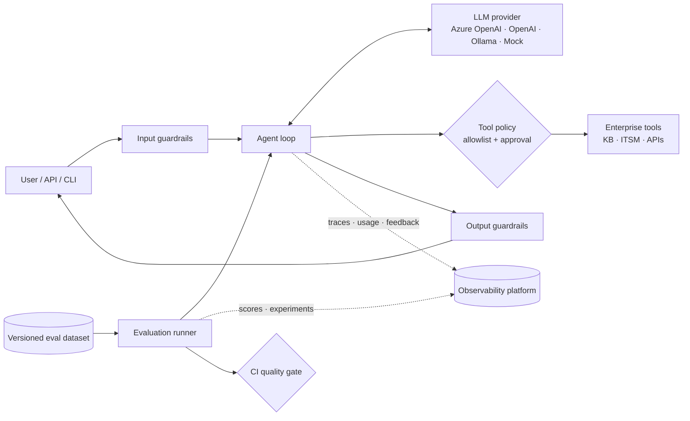

# Agent Observability & Evaluation Patterns

[](https://www.python.org/)
[](LICENSE)
[](#pattern-and-tool-catalogue)

A collection of **production-style reference implementations** showing how to **trace, monitor,
evaluate and secure AI agents** in enterprise settings.

Every folder in this repository is a **self-contained pattern or tool implementation**, such as Opik,
Langfuse or OpenTelemetry. Each one uses the same kind of sample agents and the same evaluation
approach, so you can compare tools side by side and pick what fits your organisation.

> **Who is this for?** Solution architects, AI engineers, platform teams and MLOps/LLMOps
> practitioners who need to move agentic AI from prototype to governed production: observable,
> measurable, secure and auditable.

---

## Table of contents

- [Why agent observability and evaluation?](#why-agent-observability-and-evaluation)
- [Pattern and tool catalogue](#pattern-and-tool-catalogue)
- [Core patterns covered](#core-patterns-covered)
- [Shared reference architecture](#shared-reference-architecture)
- [Repository structure](#repository-structure)
- [Getting started](#getting-started)
- [Folder conventions](#folder-conventions)
- [Choosing a tool](#choosing-a-tool)
- [Roadmap](#roadmap)
- [Contributing](#contributing)
- [License and disclaimer](#license-and-disclaimer)

---

## Why agent observability and evaluation?

Agents fail differently from traditional software and from simple chatbots:

| Failure mode | Example | What catches it |
|---|---|---|
| Wrong tool or trajectory | Opens a ticket instead of answering from the knowledge base | Trajectory evaluation, tool spans |
| Ungrounded answer | Invents a procedure or policy | Grounding and hallucination metrics, retrieved context in traces |
| Unsafe action | Executes a write operation without authorisation | Tool allowlists, human-in-the-loop, safety evaluation |
| Prompt injection | "Ignore previous instructions…" | Guardrails, adversarial test sets, guardrail feedback scores |
| Data leakage | PII or system prompt in the output | PII redaction, canary tokens, leakage metrics |
| Runaway cost or loops | Endless tool calling | Step budgets, token and cost tracking, latency alerts |
| Silent regressions | A prompt or model change degrades quality | Versioned datasets, experiments, CI quality gates |

Observability shows **what happened**. Evaluation tells you **whether it was good enough to ship**.
This repository demonstrates both, together.

---

## Pattern and tool catalogue

**Status legend:** ✅ Available &nbsp;·&nbsp; 🚧 In progress &nbsp;·&nbsp; 📋 Planned

### Observability and evaluation platforms

| Folder | Tool / pattern | Focus | Deployment | Status |
|---|---|---|---|---|
| [`opik-enterprise-agents/`](./enterprise-agent-observability) | [Opik](https://github.com/comet-ml/opik) (Comet) | Tracing, feedback scores, datasets, experiments, custom agent metrics, CI quality gate | Self-hosted or cloud | ✅ |
| [`langfuse-enterprise-agents/`](./langfuse-enterprise-agents) | [Langfuse](https://github.com/langfuse/langfuse) | Agent/tool/guardrail observations, masking, sessions, scores, datasets and experiments, prompt management | Self-hosted or cloud | ✅ |
| `arize-phoenix/` | [Arize Phoenix](https://github.com/Arize-ai/phoenix) | OpenTelemetry/OpenInference tracing, RAG and agent evaluation | Self-hosted or cloud | 📋 |
| `langsmith/` | [LangSmith](https://www.langchain.com/langsmith) | LangChain/LangGraph-native tracing and evaluation | Managed, enterprise self-hosted | 📋 |
| `mlflow-genai/` | [MLflow](https://github.com/mlflow/mlflow) | GenAI tracing, evaluation and model lifecycle | Self-hosted or managed | 📋 |
| `azure-ai-foundry/` | [Azure AI Foundry](https://learn.microsoft.com/azure/ai-foundry/) | Azure-native tracing, agent evaluators, Application Insights | Azure | 📋 |

### Vendor-neutral and evaluation-only patterns

| Folder | Tool / pattern | Focus | Status |
|---|---|---|---|
| `opentelemetry-genai/` | [OpenTelemetry](https://opentelemetry.io/) GenAI semantic conventions | Vendor-neutral instrumentation exported to any backend | 📋 |
| `deepeval/` | [DeepEval](https://github.com/confident-ai/deepeval) | pytest-style LLM and agent unit tests | 📋 |
| `ragas/` | [Ragas](https://github.com/explodinggradients/ragas) | RAG metrics: faithfulness, context precision and recall | 📋 |
| `promptfoo/` | [Promptfoo](https://github.com/promptfoo/promptfoo) | Declarative evaluations and red-teaming | 📋 |
| `multi-agent-tracing/` | CrewAI / LangGraph multi-agent traces | Supervisor and worker handoffs, per-agent attribution | 📋 |

> Folder names marked 📋 are placeholders and will be linked once available.

---

## Core patterns covered

### Observability patterns

| Pattern | Description |
|---|---|
| **Hierarchical tracing** | One trace per request; nested spans for agent, guardrail, LLM and tool steps |
| **Session / thread grouping** | Multi-turn conversations linked by `session_id` |
| **Usage and cost attribution** | Tokens, model, provider and estimated cost per span, agent and business unit |
| **Online feedback scores** | Guardrail pass/fail, user feedback and sampled LLM-judge scores on live traces |
| **Privacy-preserving export** | PII redacted before data leaves the process |
| **Fail-open instrumentation** | The tracing backend being unavailable never breaks the business flow |
| **Version attribution** | Agent, prompt and model versions recorded on every trace |
| **Structured log correlation** | JSON logs with run and trace IDs for SIEM or APM tools |

### Evaluation patterns

| Pattern | Description |
|---|---|
| **Trajectory / tool-selection evaluation** | Did the agent use the right tools, avoid forbidden ones, and stay within its step budget? |
| **Grounding and citation checks** | Deterministic keyword and citation checks, plus LLM-judge hallucination scoring |
| **Safety and adversarial evaluation** | Prompt injection, jailbreaks, privilege escalation and false-positive checks |
| **Privacy evaluation** | No PII or system-prompt leakage in outputs |
| **Offline CI quality gate** | Deterministic evaluation that fails the build on regression |
| **Experiments and A/B comparison** | Same dataset across prompts and models, compared in the platform UI |
| **Online (production) evaluation** | Scoring sampled production traces |
| **Dataset flywheel** | Production incidents and red-team findings become new test cases |

### Security controls demonstrated

Prompt-injection screening · PII redaction · canary-token leak detection · untrusted tool-output
delimiting · least-privilege tool allowlists · human-in-the-loop approval · validated tool
arguments · step and token budgets · authenticated APIs · hardened containers.

Controls are mapped to the **OWASP Top 10 for LLM Applications** in each implementation's
`docs/SECURITY.md`.

---

## Shared reference architecture

All implementations follow the same logical design. Only the observability and evaluation layer
changes between folders.



---

## Repository structure

```
agent-Observability-and-Evauation-Patterns/
├── README.md                     # You are here
├── LICENSE
├── opik-enterprise-agents/       # ✅ Opik: tracing, evaluation, security, CI gate
│   ├── README.md                 #    Install, configure, run, deploy
│   ├── src/                      #    Agents, tools, tracing, guardrails, evaluation
│   ├── tests/
│   ├── docs/                     #    Architecture, observability, evaluation, security
│   └── ...
├── langfuse-enterprise-agents/   # ✅ Langfuse: observations, masking, scores, experiments
├── arize-phoenix/                # 📋 Planned
├── opentelemetry-genai/          # 📋 Planned
├── deepeval/                     # 📋 Planned
└── ...
```

---

## Getting started

Each folder is independent and has its own README with full instructions. The general flow is:

```bash
git clone https://github.com/vinuptomy/agent-Observability-and-Evauation-Patterns.git
cd agent-Observability-and-Evauation-Patterns/opik-enterprise-agents

python -m venv .venv
source .venv/bin/activate        # Windows: .venv\Scripts\activate
pip install -e ".[api,dev]"
cp .env.example .env             # Windows: copy .env.example .env

pytest -q                        # run the tests
agentctl eval --mode local       # run the evaluation quality gate
```

Most implementations include a **deterministic mock LLM**, so you can run the demos, tests and
evaluations **without an API key**. Switch to Azure OpenAI, OpenAI or Ollama through `.env`.

**Prerequisites:** Python 3.10+, Git; Docker is optional (for self-hosted platforms and container
deployment).

---

## Folder conventions

To keep implementations comparable, every pattern folder aims to provide:

| Item | Purpose |
|---|---|
| `README.md` | Overview, prerequisites, install, configuration, run, deploy, troubleshooting |
| `.env.example` | All configuration via environment variables, with no secrets committed |
| Sample agent(s) | Enterprise scenarios (IT service desk, policy Q&A, and similar), not personal use cases |
| System instructions | Versioned prompt files |
| Evaluation dataset | JSONL test cases with expected tools, forbidden tools, keywords and safety flags |
| Evaluation criteria | Metrics, thresholds and featured test cases (`docs/EVALUATION_CRITERIA.md`) |
| Security documentation | Threat model and controls (`docs/SECURITY.md`) |
| Tests | Unit and agent-behaviour tests runnable offline |
| Deployment assets | Dockerfile and/or compose, CI workflow |

**Naming:** folders use lowercase `kebab-case`, named after the tool or pattern
(for example `langfuse`, `opentelemetry-genai`).

---

## Choosing a tool

There is no single best tool; the right choice depends on your constraints. A quick orientation:

| If you need… | Start with |
|---|---|
| Open-source, self-hosted tracing plus evaluation in one platform | `opik-enterprise-agents/`, `langfuse/`, `arize-phoenix/` |
| Deep LangChain / LangGraph integration | `langsmith/` |
| Vendor-neutral instrumentation you can route anywhere | `opentelemetry-genai/` |
| An Azure-native, Microsoft-governed stack | `azure-ai-foundry/` |
| Evaluation as pytest-style unit tests in CI | `deepeval/` |
| RAG-specific quality metrics | `ragas/` |
| Red-teaming and declarative test suites | `promptfoo/` |

Enterprise selection criteria worth weighing: **data residency and self-hosting** (GDPR, EU AI
Act logging obligations), **SSO/RBAC**, **retention controls**, **framework integrations**,
**OpenTelemetry support**, **cost at trace volume**, and **vendor lock-in**.

Features and licensing of these tools change frequently. Verify against each project's current
documentation before making a decision.

---

## Roadmap

- [x] Opik: enterprise agents, tracing, custom agent metrics, CI quality gate, security controls
- [x] Langfuse implementation
- [ ] Arize Phoenix with OpenInference
- [ ] OpenTelemetry GenAI semantic conventions (vendor-neutral)
- [ ] DeepEval and Ragas evaluation suites
- [ ] Promptfoo red-teaming suite
- [ ] Multi-agent (CrewAI / LangGraph) tracing patterns
- [ ] Azure AI Foundry evaluation and tracing
- [ ] Cross-tool comparison matrix using the same dataset and agents

---

## Contributing

Contributions, issues and suggestions are welcome.

1. Fork the repository and create a branch: `git checkout -b feature/<tool-or-pattern>`.
2. Add a new folder following the [folder conventions](#folder-conventions).
3. Make sure tests and the offline evaluation pass.
4. Update the [catalogue](#pattern-and-tool-catalogue) table in this README.
5. Open a pull request describing the pattern, the tool version used and how to run it.

Please never commit API keys, real customer data or personal data.

---

## License and disclaimer

Released under the [MIT License](LICENSE).

These are **reference implementations for learning and architecture guidance**. They are not
production-certified products. Sample data (for example "Contoso Enterprise") is fictional.
Review security, privacy and compliance requirements (such as GDPR and the EU AI Act) for your own
organisation before any production use.

---

**Author:** [Vinu P. Tomy](https://github.com/vinuptomy), Solution Architect focused on enterprise
AI, GenAI and agentic systems.

⭐ If this repository helps you, consider giving it a star.
